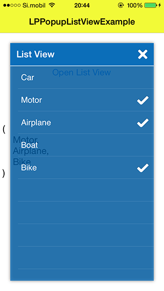

#LPPopupListView

LPPopupListView is custom popup component for iOS with table for single or multiple selection.



Created by Luka Penger
http://lukapenger.eu

##Usage

If you'd like to include this component as a pod using CocoaPods, just add the following line to your Podfile:

`pod "LPPopupListView"`

##ARC

LPPopupListView uses ARC (Automatic Reference Counting).

If you are using LPPopupListView in your non-arc project, you will need to set a `-fobjc-arc` compiler flag on all of the LPPopupListView source files.

To set a compiler flag in Xcode, go to your active target and select the "Build Phases" tab. Now select all LPPopupListView source files, press Enter, insert `-fobjc-arc` and then "Done" to disable ARC for LPPopupListView.

##Uses Frameworks

* UIKit.framework
* Foundation.framework

##Delegate methods

```objective-c
- (void)popupListView:(LPPopupListView *)popupListView didSelectedIndex:(NSInteger)index;
- (void)popupListViewDidHide:(LPPopupListView *)popupListView selectedList:(NSArray *)list;
```

```objective-c
#pragma mark - LPPopupListViewDelegate

- (void)popupListView:(LPPopupListView *)popUpListView didSelectedIndex:(NSInteger)index
{
    NSLog(@"popUpListView - didSelectedIndex: %d", index);
}

- (void)popupListViewDidHide:(LPPopupListView *)popUpListView selectedList:(NSArray *)list
{
    NSLog(@"popupListViewDidHide - selectedList: %@", list.description);
}
```

##License

This code is distributed under the terms and conditions of the [MIT license](https://github.com/luka1995/LPPopupListView/blob/master/LICENSE).

##Change log

A brief summary of each LPPopupListView release can be found on the [wiki](https://github.com/luka1995/LPPopupListView/wiki/Change-log).
